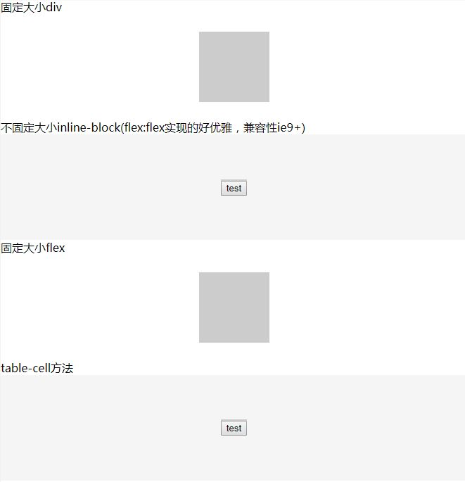

# 垂直水平居中
```HTML
<!-- HTML -->
固定大小div
<div class="div">
  <div class="test-c test-wh test1"></div>
</div>
不固定大小inline-block(flex:flex实现的好优雅，兼容性ie9+)
<div class="div">
  <div class="test-c test2">
    <button>test</button>
  </div>
</div>
固定大小flex(兼容性ie9+)
<div class="div">
  <div class="test-c test-wh test3"></div>
</div>
table-cell方法（CSS2.1内容用兼容性好）
<div class="div">
  <div>
    <div class="test-c test3">
      <button>test</button>
    </div>
  </div>
</div>
```
```CSS
/* CSS */
html, body {
  margin: 0;
  padding: 0;
  height: 100%;
}
.div {
  height: 300px;
  /*  BFC  */
  position: relative;
}
/* 无视 */
.div:nth-child(odd) {
  background: white;
}
/* 无视 */
.div:nth-child(even) {
  background: whitesmoke;
}
/* 无视 */
.test-c {
  background: #cccccc;
}
/* 固定大小 */
.test-wh {
  width: 100px;
  height: 100px;
}
/* 最普遍的固定大小上下左右居中 */
.test1 {
  margin: auto;
  position: absolute;
  top: 0; left: 0; right: 0; bottom: 0;
}
/* flex针对inline-block居中 */
.div:nth-child(2) {
  display: flex;
  justify-content: center;
  align-items: center;
}
/* 设置inline-block */
.test2 {
  display: inline-block;
}
/* flex针对block居中 (same as inline-blick)*/
.div:nth-child(3) {
  display: flex;
  justify-content: center;
  align-items: center;
}
/* table-cell实现 */
/* 对table-cell元素设置百分比（如100%）的宽高值时无效的，但是可以将父元素设置display:table，再将父元素设置百分比宽高，子元素table-cell会自动撑满父元素。这就可以做相对于整个页面的水平垂直居中。 */
.div:nth-child(4) {
  display: table;
  width: 100%;
}
.div:nth-child(4)>div {
  display: table-cell;
  text-align: center;
  vertical-align: middle;
}
.test3 {
  display: inline-block;
}
```



[[codepen]代码](https://codepen.io/mrzhao1129/pen/ZvQgOy?editors=1100)