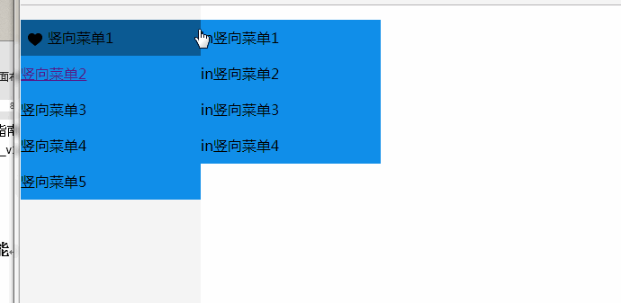
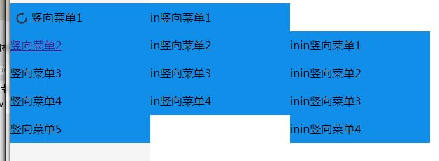

## 纯CSS竖型菜单实现
无图无真相



先来看HTML骨架，下面代码是一个嵌套了三层的无序列表。
```html
<ul>
  <li>
    <span><div class="icon icon1"></div>竖向菜单1</span>
    <ul>
      <li>
        <span>in竖向菜单1</span>
      </li>
      <li>
        <span>in竖向菜单2</span>
        <ul>
          <li>inin竖向菜单1</li>
          <li>inin竖向菜单2</li>
          <li>inin竖向菜单3</li>
          <li>inin竖向菜单4</li>
        </ul>
      </li>
      <li>in竖向菜单3</li>
      <li>in竖向菜单4</li>
    </ul>
  </li>
  <li><a href="#">竖向菜单2</a></li>
  <li><a>竖向菜单3</a></li>
  <li><a>竖向菜单4</a></li>
  <li><a>竖向菜单5</a></li>
</ul>
```
接下来实现菜单的布局调整
```css
ul {
  padding: 0;/* 清除自带的padding效果 */
  background: rgb(16, 142, 233);
}
li {
  line-height: 40px;
  list-style-type: none;/* 清除自带的有一个点效果 */
  cursor: pointer;
  position: relative;/* BFC，用来初始化子菜单的位置 */
}
li>ul {
  position: absolute;/* 绝对定位，对于父菜单定位 */
  left: 200px;
  top: 0;
  width: 200px;
}
```
效果图如下



基本显示层次感是有了，这中间涉及到BFC的知识点。简单来说BFC就是新建一个图层。
> ### BFC作用
>1. 阻止外边距折叠
>2. 可以包含浮动元素
>3. 阻止元素被浮动元素覆盖
> ### 创建BFC的CSS样式：
> * fload: 除去none
> * overflow: 除去visible(比如hidden,auto,scroll...)
> * display: table-cell,table-caption,inline-block,table-caption(css3);(table不产生BFC，但其内部包含匿名的table-cell)
> * position: absolute,fixed,relative,fixed(css3)

接下来加上hover和transition过渡效果，完工。
```css
li:hover {
  background: rgb(12, 91, 148);
}
li:hover>ul {
  transition: opacity .5s cubic-bezier(0.4, 0, 0.2, 1);/* 动画效果过程 */
  opacity: 1;
  visibility: visible;/* 用来显示菜单 */
}
li>ul {
  opacity: 0.5;/* 动画效果初始化 */
  visibility: hidden;/* 默认菜单隐藏 */
}
```
[源码地址](./source/menu.html)