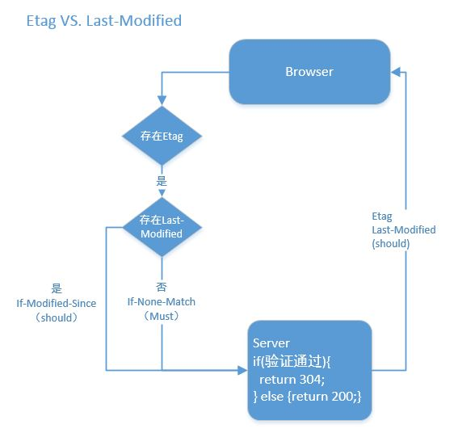
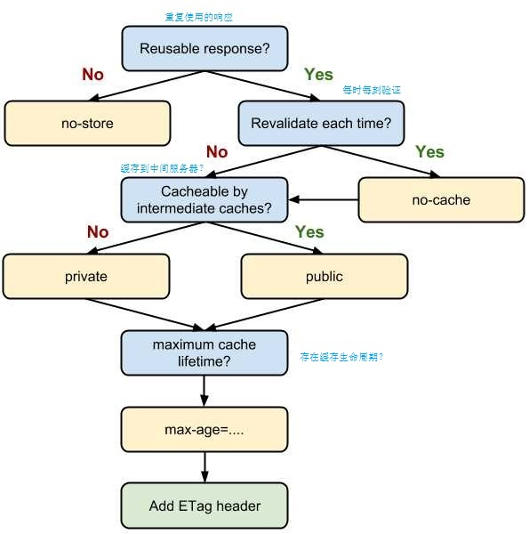

# 浏览器的缓存方案（笔记）
浏览器相关资源的缓存是通过头(header)进行配置的，下边列一些常用到的关于缓存的头配置项。
## HTTP/1.0  
`Expires: Fri, 02 Jan 2000 00:00:00 GMT`
## HTTP/1.1
|Header|验证器|req/res|描述|
|--|--|--|--|
|`Cache-Control: max-age=31536000`|弱|Response|最大缓存时间；单位s；最大值31536000（一年）；|
|`Cache-Control: no-cache`|强|Response||
|`Etag: "5a41e638-7ac"`|强|Response|请求返回的id;|
|`Last-Modified:Tue, 26 Dec 2017 06:03:36 GMT`|弱|Response|最后修改时间；|
|`If-None-Match: "5a41e638-7ac"`||Request|用于告诉服务器当前浏览器拥有的资源版本；|
|`If-Modified-Since: Tue, 26 Dec 2017 06:03:36 GMT`||Request||
> **强验证:** 期望的是资源字节级别的一致  
> **弱验证:** 只要资源的主要内容一致即可，允许例如页底的广告，页脚不同
## 设置不验证（Expires设置最大）
通过nginx设置`expires max;`（过期时间设置超级大）后
```
Response Headers

Cache-Control:max-age=315360000    //这里是重点
Connection:keep-alive
Date:Fri, 05 Jan 2018 08:44:12 GMT
ETag:"5a4f39a0-83c"
Expires:Thu, 31 Dec 2037 23:55:55 GMT    //这里是重点
Last-Modified:Fri, 05 Jan 2018 08:38:56 GMT
Server:nginx/1.12.0

Request Headers

Accept:text/html,application/xhtml+xml,application/xml;q=0.9,image/webp,image/apng,*/*;q=0.8
Accept-Encoding:gzip, deflate
Accept-Language:zh-CN,zh;q=0.9
Cache-Control:max-age=0    //不管刷新多少次这里都是0:weary:
Connection:keep-alive
DNT:1
Host:172.21.167.1:8089
If-Modified-Since:Fri, 05 Jan 2018 08:38:56 GMT
If-None-Match:"5a4f39a0-83c"
Upgrade-Insecure-Requests:1
User-Agent:Mozilla/5.0 (Windows NT 6.1; WOW64) AppleWebKit/537.36 (KHTML, like Gecko) Chrome/62.0.3202.89 Safari/537.36
```
### If-None-Match运行流程

## "no-cache", "no-store", "must-revalidate"
> ### Cache-Control
> * no-cache【强验证】：虽然字面意义是“不要缓存”。但它实际上的机制是，仍然对资源使用缓存，但每一次在使用缓存之前必须（MUST）向服务器对缓存资源进行验证。（实际使用等于no-store）
> * no-store: 不使用任何缓存
> * must-revalidate: `Cache-Control: must-revalidate, max-age=60` 缓存小于max-age使用缓存，不然对资源进行验证
> * max-age=31536000【弱验证】: 缓存最长时间
## Expires VS. max-age
是相同功能，不同时期的产物
## Etag VS. Last-Modified

## max-age=0 VS. no-cache
## public VS. private
设置中间服务器（用户Client到Server之间的中间服务器）的缓存设置，private为中间服务器不缓存，public为缓存。

综上缓存(Cache-Control)流程示意图：


## 服务工作线程
:smirk:还没看明白，下面有参考文章。

[参考文章：设计一个无懈可击的浏览器缓存方案：关于思路，细节，ServiceWorker，以及HTTP/2](https://zhuanlan.zhihu.com/p/28113197)  
[参考文章：[MDN]Cache-Control参考](https://developer.mozilla.org/zh-CN/docs/Web/HTTP/Headers/Cache-Control)  
[参考文章：[developers.google.com]服务工作线程：简介](https://developers.google.com/web/fundamentals/primers/service-workers/)