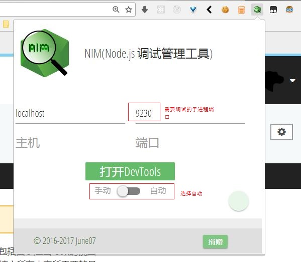

# node多进程调试
题外：VSCode中对于常规的调试上手还是比较简单的，但是今天用到了进程`child_process`，断点死活进不去。查了小半天，百度、谷歌翻了个遍，全都讲的迷迷糊糊，也可能是因为刚上手node的缘故。临近下班摸索出一个解决方案，VSCode进行常规的调试（debug），利用再开一个chrom进行子进程的调试（debug）。
1. 利用npm全局安装nodemon后，在vs code debug配置配置中添加如下debug配置信息。[launch.js及nodemon相关](../JS/launch.json.md)。
```javascript
{
  "type": "node",
  "request": "launch",
  "name": "nodemon",
  "runtimeExecutable": "nodemon",
  "program": "${workspaceRoot}\\bin\\www",
  "restart": true,
  "console": "integratedTerminal",
  "internalConsoleOptions": "neverOpen",
  "env": {
    "NODE_ENV": "dev"
  }
}
```  
2. 在chrome中安装[NIM插件](https://chrome.google.com/webstore/detail/nodejs-v8-inspector-manag/gnhhdgbaldcilmgcpfddgdbkhjohddkj)，安装好插件后先放着，进行下一步。  

3. 接下来是代码部分，nodemon在启动整个项目时候debug监听的端口是随机的每次都会变的（不特别设置的话。node官方推荐默认inspect debug端口为9229），子进程我们在debug时候也需要指定一个端口进行监听（必须指定不然在主进程inspect debug时候子进程会与主进程端口冲突），下面代码我用一个环境变量`process.env.NODE_ENV`来区分当前运行在调试模式还是生产模式。由于我的项目中根据设置要生成更多的进程，所以我用一个累加来定义这个端口。 
```javascript
var startPort = 9229;

if(process.env.NODE_ENV === 'dev') {
  this.worker = child_process.fork(path.join(__dirname, "jsonet.client.process.js"), {
    execArgv: ['--inspect=' + startPort++]
  });
} else {
  this.worker = child_process.fork(path.join(__dirname, "jsonet.client.process.js"));
}
```
4. 在这之后重新把NIM拿出来，设置到你需要调试的那个子进程端口上。运行程序，chrom会自动打开相应的调试页面，enjoy it，和chrome F12调试前端js代码一样一样的。  



---
(题外：了解线程、进程知识及node的支持情况，读blog笔记 [[参考文章：Node.js的线程和进程详解]](https://github.com/xiongwilee/blog/issues/9))
## 单线程的优势
### 高性能
* php：一个请求创建一个线程（频繁创建、切换线程）。
* node：只有一个进程，在生产实践中即使请求量很大，相应内存占用很低。
### 线程安全
由于是单线程操作，不涉及线程安全相关问题。
### 单线程的异步和非阻塞
node底层访问I/O是多线程的  
阻塞/非阻塞与异步/同步概念
### 阻塞的单线程
```javascript
var start = Date.now();//获取当前时间戳
setTimeout(function () {
  console.log(Date.now() - start);
  for (var i = 0; i < 1000000000; i++){//执行长循环
  }
}, 1000);
setTimeout(function () {
  console.log(Date.now() - start);
}, 2000);
/*
1002
3032
*/
```
**一个node进程在某一时刻其实只是处理一个请求**
### 单线程和多核
node无法充分利用多核cpu的性能[[PM2可以解决？]](http://pm2.keymetrics.io/)
## 多线程
node官方没有提供关于多线程的api
### tagg2模块
> tagg包只能在linux下运行；tagg2可以支持mac、linux、windows  

针对一些可以使用js原生的大量计算或循环可以使用tagg2，Node.js核心api因为无法从主线程共享对象的关系，也就不能跨线程使用了。
### libuv
> libuv是一个跨平台的异步I/O库，它主要用于Node.js的开发，同时他也被Mozilla's Rust language, Luvit, Julia, pyuv等使用。它主要包括了Event loops事件循环，Filesystem文件系统，Networking网络支持，Threads线程，Processes进程，Utilities其他工具。

node API中大部分异步多线程就是用libuv实现
## <s>多进程</s>
### <s>cluster</s>
### <s>child_process</s>
* <s>fork</s>
* <s>spawn</s>  
## <s>多线程与多进程</s>