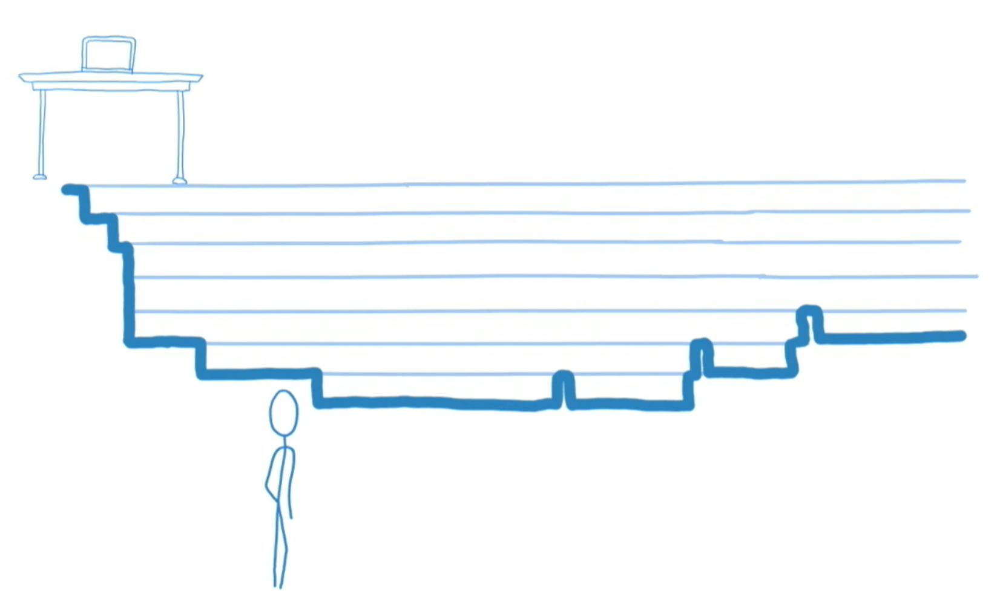
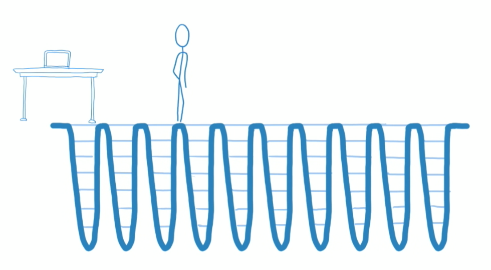
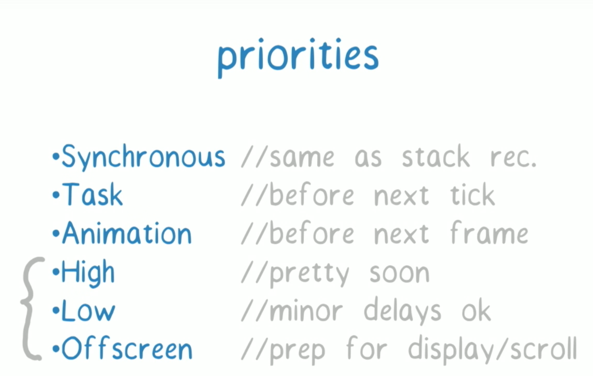

# React16 新特性官网翻译
New core architecture

React 16 is the first version of React built on top of a new core architecture, codenamed “Fiber.” You can read all about this project over on Facebook’s engineering blog. (Spoiler: we rewrote React!)

Fiber is responsible for most of the new features in React 16, like error boundaries and fragments. Over the next few releases, you can expect more new features as we begin to unlock the full potential of React.

Perhaps the most exciting area we’re working on is async rendering—a strategy for cooperatively scheduling rendering work by periodically yielding execution to the browser. The upshot is that, with async rendering, apps are more responsive because React avoids blocking the main thread.

This demo provides an early peek at the types of problems async rendering can solve:

> Ever wonder what "async rendering" means? Here's a demo of how to coordinate an async React tree with non-React work https://t.co/3snoahB3uV pic.twitter.com/egQ988gBjR
> — Andrew Clark (@acdlite) September 18, 2017

Tip: Pay attention to the spinning black square.

We think async rendering is a big deal, and represents the future of React. To make migration to v16.0 as smooth as possible, we’re not enabling any async features yet, but we’re excited to start rolling them out in the coming months. Stay tuned!

新的核心体系结构

React16是第一个在一个新的核心体系结构上开发的版本，核心成为“Fiber”。你可以在Facebook的开发者博客中了解这个项目中的信息。（提示：我们重构了React！）

在React16中，Fiber包含了大部分新的特征，比如错误边界和碎片。在接下来几个版本中，你可以期待更多新的特征来释放React更大的潜力。

也许最让人激动的是我们开发的异步渲染：一个通过定期执行来协调调度渲染的策略。结果是，在异步渲染中，因为React避免了主进程的阻塞导致应用更加的流畅。

这个例子提供预览一个解决一类异步问题的办法：

> 之前不明白“异步渲染”是什么意思？这里有一个demo展示在没有React工作时的异步React树https://t.co/3snoahB3uV pic.twitter.com/egQ988gBjR  
> — Andrew Clark (@acdlite) September 18, 2017

提示：注意Restart时候黑色旋转方块。

我们认为异步渲染是一个大的问题，并且代表React的未来。尽可能平滑的过渡到v16.0版本，我们之前不允许任何异步功能，但是我们非常激动能推出它在未来的几个月。敬请关注。

## 新旧版本的协调算法
* Stack Reconciler
> 重点在于，Stack Reconciler始终会一次性地同步处理整个组件树。Stack Reconciler无法暂停，因此如果更新较为深入并且可用CPU时间有限，这种做法并非最优化的。

* Fiber Reconciler
> 简单来说，此时不在需要等待变更传播到整个组件树，React Fiber可以知道如何时不时暂停一下，检查是否有其他更重要的更新。这种调度能力主要基于requestIdleCallback的使用，而这是一种W3C候选推荐标准。

  
  

[【参考】官方网站](https://reactjs.org/blog/2017/09/26/react-v16.0.html#new-core-architecture)  
[【参考】[译] React 16 带来了什么以及对 Fiber 的解释](https://juejin.im/post/59de1b2a51882578c70c0833)